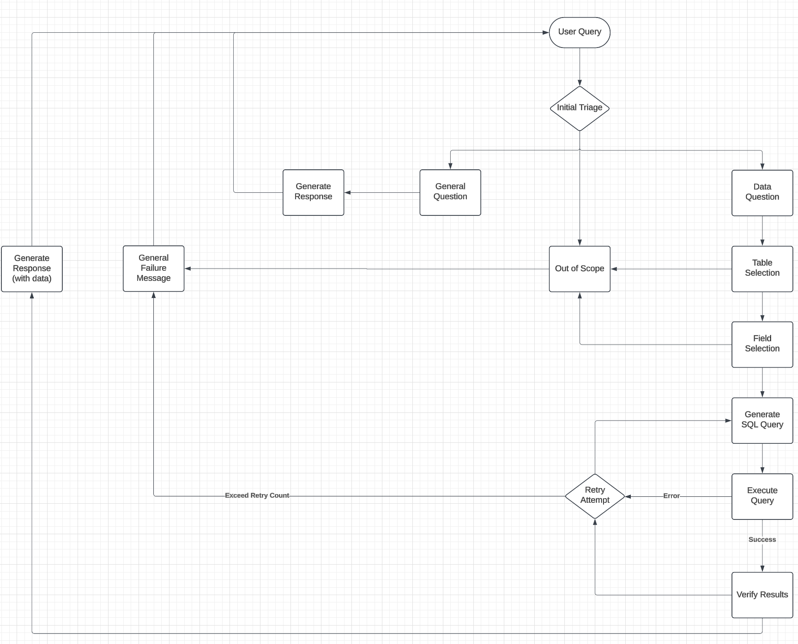

# AI SQL Query Generator

A demonstration application showcasing Query RAG (Retrieval-Augmented Generation) capabilities with AI-powered SQL query generation. This application allows users to upload CSV files, automatically analyze their contents, and use natural language to query the data through an AI workflow.

## Features

- 📤 CSV file upload with drag-and-drop support
- 📊 Automatic schema detection and PostgreSQL table creation
- 🤖 AI-powered natural language to SQL conversion
- 🔍 Smart query analysis and validation
- 💡 Intelligent error handling and query regeneration
- 🎯 Context-aware responses based on available data

## Architecture



The application consists of two main components:

### Frontend (`ui/src/App.tsx`)
- React-based UI utilizing TypeScript and shadcn/ui components
- Enables users to upload CSV files and query the data using natural language

### Backend (`server/src`)
- Express.js server with TypeScript
- PostgreSQL database integration
- Multi-step AI query processing pipeline:
  1. Query triage and classification
  2. Schema analysis and table profiling
  3. SQL generation
  4. Result formatting
  5. Answer validation

### Table Analyzer (`server/src/tableAnalyzer.ts`)
The table analyzer component performs intelligent data profiling:
- Samples data from uploaded tables
- Analyzes column types, distinct values, and null ratios
- Generates statistical summaries (min/max for numeric/dates)
- Creates AI-powered descriptions of each field
- Provides context for more accurate query generation

## Setup

1. Install dependencies:

# Frontend
```
cd ui
npm install
```

# Backend
1. Install dependencies:
```
cd server
npm install
```

2. Set up your PostgreSQL database and configure environment variables:
   Copy the `.env.sample` file to `.env` and update the values:

```env
DB_USER=postgres
DB_HOST=localhost
DB_NAME=sqlgen
DB_PASSWORD=admin
DB_PORT=5432
PORT=3000
OPENAI_API_KEY=your_openai_api_key
```

3. Start the development servers:

# Frontend
```
cd ui
npm run dev
```

# Backend
```
cd server
npm run dev
```

## How It Works

1. **CSV Upload**
   - Upload a CSV file through drag-and-drop or file selection
   - The server automatically detects column types and creates a PostgreSQL table
   - Table schema is analyzed and stored for future queries

2. **Query Processing**
   - User enters a natural language question
   - Query is classified as general, data-specific, or out-of-scope
   - For data queries:
     - Available schema is analyzed for relevance
     - SQL query is generated using AI
     - Results are formatted into natural language
     - Response is validated for accuracy

3. **Error Handling**
   - Multiple retry attempts for failed queries
   - Context-aware error messages
   - Query regeneration with previous error context

## Example Usage

1. Upload a CSV file:
   ```
   Drag and drop your CSV file into the upload area
   Enter a table name for your data
   Click "Upload CSV"
   ```

2. Query your data:
   ```
   "Show me the total sales by region for last month"
   "What was the average order value per customer?"
   "Which products had the highest growth rate?"
   ```

## Technical Details

The application uses a sophisticated prompt engineering approach to generate accurate SQL queries:

- Query classification to determine appropriate response type
- Schema analysis to identify relevant tables and relationships
- PostgreSQL-specific query generation with best practices
- Multi-step validation to ensure accurate responses
- Error recovery with context-aware query regeneration